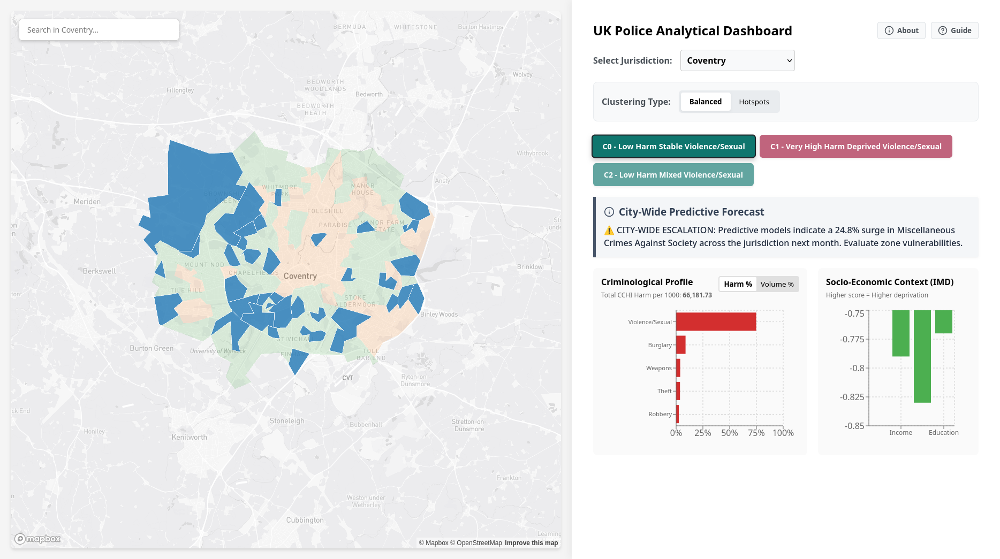

# UK Police Analytical Dashboard

**Final Product — 4CBLW020 Addressing real-world crime and security problems with data science (Group 4)**

An advanced, React-based spatial analysis dashboard designed to help law enforcement agencies allocate resources based on criminological reality rather than arbitrary district boundaries. 

By categorizing urban centers into distinct archetypes using **Unsupervised Clustering (K-Means & DBSCAN)**, this tool balances crime volume, the Cambridge Crime Harm Index (CCHI), and neighborhood deprivation data (IMD) to support data-driven policing.


---

## The Team (Group 4)
* Sander Simson
* Cem Vamik
* Manan Goel
* Hugo Kandjee Romero
* Mark van Riet
* Bogdan Spătaru

---

## Key Features

* **Dual-Algorithm Clustering Strategy:**
  * **Balanced (K-Means):** Groups neighborhoods (LSOAs) based on overall socio-economic and criminological profiles for long-term strategic planning.
  * **Hotspots (DBSCAN):** Isolates hyper-dense areas of severe activity, filtering out background urban "noise" for immediate tactical taskforce deployment.
* **Predictive Forecasting:** Analyzes recent city-wide crime trends and dynamically injects predictive alerts (e.g., predicted surges in burglary or violence) into specific, highly-vulnerable neighborhood clusters.
* **LSOA Search:** Custom Mapbox integration that calculates polygon centroids to automatically "fly to" searched LSOAs.

---

## Architecture & Tech Stack

### Frontend Application
* **Framework:** React (Vite)
* **Mapping:** Mapbox GL JS (`react-map-gl/mapbox`)
* **Data Visualization:** Recharts
* **Icons & UI:** Lucide-React


---

## Getting Started

Follow these instructions to run the dashboard locally on your machine.

### Prerequisites
1. **Node.js** (v16 or higher)
2. A free **Mapbox Access Token** (Sign up at [mapbox.com](https://www.mapbox.com/))

### Installation

1. **Clone the repository:**
   ```bash
   git clone https://github.com/cvamik06/london-map.git
   cd london-map
2. **Install dependencies:**
   ```bash
   npm install

3. **Create a .env file in the root directory and add your Mapbox token:**
   ```bash
   VITE_MAPBOX_TOKEN=pk.your_mapbox_token_here
4. **Verify data files:**
Make sure you have the following files present in your `public/` folder:
- LSOA_Boundaries.geojson (The raw map shapes)
- cluster_data.json (The Mapbox layer data)
- forecast_data.json (The forecasting data)

5.**Start the development server:**
  ```bash
  npm run dev
